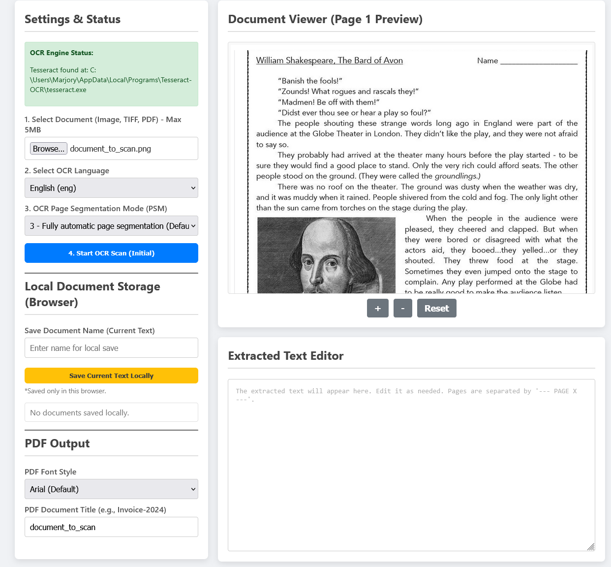

# 📸 Image-to-Editable-PDF Converter

A **robust, professionally structured Python-based web application (Flask)** that performs asynchronous Optical Character Recognition (OCR) on uploaded documents, allows text editing, and converts the final content into a secure, downloadable, multi-page PDF.

## 👤 Author

**Marjory D. Marquez**


---


## Project Image




---


## ✨ Key Features and Improvements

The project has been significantly enhanced for better document handling:

### **Core Functionality**
* **Asynchronous OCR:** Uses **Python Threading** to handle long-running OCR tasks in the background, ensuring the web interface remains responsive and can be polled for job status.
* **Language Detection & Correction:** Automatically detects the source document's language and applies **Spell Checking** to the OCR output for superior accuracy.
* **Robust Document Scanning:** Supports **single-page images** (`PNG`, `JPG`) and **multi-page documents** (`PDF`, `TIFF`).
* **Reliable OCR:** Uses the powerful **Tesseract** engine for accurate text extraction.
* **Zero-Dependency PDF/TIFF Rendering:** Uses **PyMuPDF** (`fitz`) to reliably process multi-page PDF and TIFF files *without* requiring external dependencies like Ghostscript.

### **Security & Project Structure**
* **Secure File Handling:** Implemented in `security.py` to prevent **directory traversal attacks** and sanitize all filenames.
* **Rate Limiting:** Protects the resource-intensive `/upload` endpoint using **Flask-Limiter** to prevent abuse.
* **Modular Architecture:** Code is professionally organized into dedicated modules (`utils.py`, `security.py`) and uses a robust, environment-aware **Configuration Class** (`config.py`).
* **Automatic Cleanup:** Files in the `uploads` directory are **automatically deleted** after a set time (default: 1 hour) to manage disk space.
* **Unit Testing & CI:** Includes a comprehensive **`test_ocr.py`** file and a **GitHub Actions workflow** for Continuous Integration.


### **Output & Testing**
* **Multi-Page PDF Generation:** Converts the final, edited text, preserving page breaks, into a clean PDF using **fpdf**.

## 🛠️ Prerequisites

* **Python 3.8+**
* **Tesseract OCR:** Must be installed on your system and accessible via the command line.
* *Installation:* Follow the instructions for your OS (e.g., `sudo apt install tesseract-ocr` on Debian/Ubuntu).

    * **Configuration:** If Tesseract is not in your system PATH, you may need to set the `TESSERACT_CMD` environment variable.

## 📦 Required Python Libraries

All necessary Python libraries can be installed using `pip` from the project's **`requirements.txt`** file:

```bash
pip install -r requirements.txt


## 🚀 Setup and Run

```

###  1. Clone the Repository

Bash

git clone [https://github.com/YourUsername/ImageToPDF_App.git](https://github.com/YourUsername/ImageToPDF_App.git)
cd ImageToPDF_App


---

### 2. Configure Environment

Create a file named .env in the root directory and set the following variables.

    Crucial: Use a strong, random key for FLASK_SECRET_KEY in any non-development environment.

    The FLASK_ENV controls which configuration settings (Development, Testing, or Production) are loaded via config.py.

---
### Code snippet

#### .env file content
FLASK_ENV="development" 
FLASK_SECRET_KEY="A_VERY_LONG_RANDOM_KEY_HERE"

#### Optional: Path to Tesseract if not in system PATH
#### TESSERACT_CMD="/usr/bin/tesseract" 

---

### 3.  Install Dependencies

Ensure your virtual environment is active, then install the required Python packages:
Bash

pip install -r requirements.txt

### 4. Access the App

Open your web browser and navigate to:

[http://127.0.0.1:5000](http://127.0.0.1:5000)


### 🧪 Running Tests

Verify the project's integrity by running the unit tests:
Bash

python test_ocr.py -v